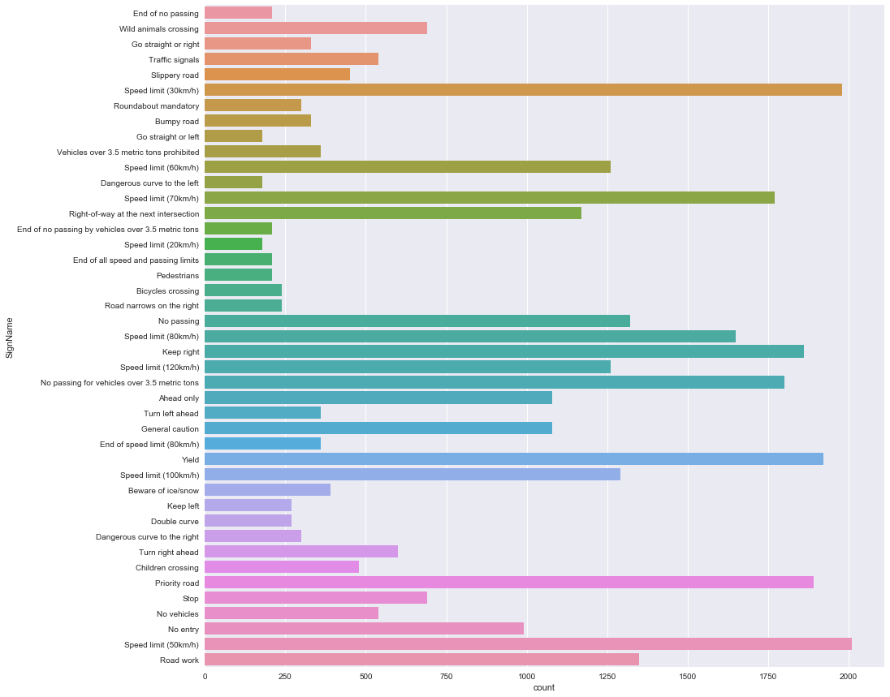
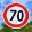
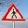

# **Traffic Sign Recognition** 

## Writeup

### You can use this file as a template for your writeup if you want to submit it as a markdown file, but feel free to use some other method and submit a pdf if you prefer.

---

**Build a Traffic Sign Recognition Project**

The goals / steps of this project are the following:
* Load the data set (see below for links to the project data set)
* Explore, summarize and visualize the data set
* Design, train and test a model architecture
* Use the model to make predictions on new images
* Analyze the softmax probabilities of the new images
* Summarize the results with a written report

[//]: # (Image References)

[image1]: ./examples/visualization.jpg "Visualization"
[image2]: ./examples/grayscale.jpg "Grayscaling"
[image3]: ./examples/random_noise.jpg "Random Noise"
[image4]: ./examples/placeholder.png "Traffic Sign 1"
[image5]: ./examples/placeholder.png "Traffic Sign 2"
[image6]: ./examples/placeholder.png "Traffic Sign 3"
[image7]: ./examples/placeholder.png "Traffic Sign 4"
[image8]: ./examples/placeholder.png "Traffic Sign 5"

## Rubric Points
### Here I will consider the [rubric points](https://review.udacity.com/#!/rubrics/481/view) individually and describe how I addressed each point in my implementation.  

---
### Writeup / README

#### 1. Provide a Writeup / README that includes all the rubric points and how you addressed each one. You can submit your writeup as markdown or pdf. You can use this template as a guide for writing the report. The submission includes the project code.

Here is a link to my notebook [project code](https://github.com/hravat/CarND-Traffic-Sign-Classifier-Project/blob/master/Traffic_Sign_Classifier.ipynb)

### Data Set Summary & Exploration

#### 1. Provide a basic summary of the data set. In the code, the analysis should be done using python, numpy and/or pandas methods rather than hardcoding results manually.

I used the pandas library to calculate summary statistics of the traffic
signs data set:

The following are the details of the exploration of the dataset

<table style="width:100%">
  <tr>
    <th>Parameter</th>
    <th>Value</th> 
  </tr>
  <tr>
    <td>Number of training examples</td>
    <td>34799</td> 
  </tr>
  <tr>
    <td>Number of testing examples</td>
    <td>12630</td> 
  </tr>
  <tr>
    <td>Number of validation examples</td>
    <td>4410</td> 
  </tr>
  <tr>
    <td>Image data shape </td>
    <td>(32, 32, 3)</td> 
  </tr>
  <tr>
    <td>Number of classes</td>
    <td>43</td> 
  </tr>
</table>

#### 2. Include an exploratory visualization of the dataset.

Here is an exploratory visualization of the data set. It is a bar chart showing counts.

     
From the histogram there does not seem to be any major imbalance in calasses. 

Also upon displaying & inspecting random  images I find the following      
1) High contrast:- THe images are very bright or very Dark 
2) The images are blurry 
3) For few of the images they are warped 

### Design and Test a Model Architecture

#### 1. Describe how you preprocessed the image data. What techniques were chosen and why did you choose these techniques? Consider including images showing the output of each preprocessing technique. Pre-processing refers to techniques such as converting to grayscale, normalization, etc. (OPTIONAL: As described in the "Stand Out Suggestions" part of the rubric, if you generated additional data for training, describe why you decided to generate additional data, how you generated the data, and provide example images of the additional data. Then describe the characteristics of the augmented training set like number of images in the set, number of images for each class, etc.)

Initially as suggested I normalized the image 
However in the code I was getting validation accuracy only 80% 
After going through the Knowledge hub I used image-128.0 instead of using image-128. 
As a result accuracy shot up to 93.8% without changin anything. 

I tried using non grayscaled image but failed on accuracy 
Here the accuracy was falling to 11% 
Also converting to grayscale saves space as there is only one channel and I completed th project on my laptop 
The images are available in cells 9,10,11 of the notebook 

#### 2. Describe what your final model architecture looks like including model type, layers, layer sizes, connectivity, etc.) Consider including a diagram and/or table describing the final model.

My final model consisted of the following layers available in cell 19 of the notebook

| Layer         		|     Description	        					| 
|:---------------------:|:---------------------------------------------:| 
| Input         		| 32x32x3 RGB image   							| 
| Convolution Weights 1    	|w1:0 (float32_ref 5x5x1x20) [500, bytes: 2000] 	|
| Bias 1					|	Variable:0 (float32_ref 20) [20, bytes: 80]|
| RELU	      	|  				|
| DropOut	    |       									|
| Maxpool 		|	 ksize=[1, 2, 2, 1], strides=[1, 2, 2, 1]								|
| Convolution Weights 2    	|w2:0 (float32_ref 5x5x20x40) [20000, bytes: 80000] |
| Bias 2					|Variable_1:0 (float32_ref 40) [40, bytes: 160]|
| RELU	      	|  				|
| DropOut	    |       									|
| Maxpool 		|	 ksize=[1, 2, 2, 1], strides=[1, 2, 2, 1]
Fully Connected Layer 1 | Variable_2:0 (float32_ref 1000x250) [250000, bytes: 1000000]  
Bias  Fully Connected Layer 1 | Variable_3:0 (float32_ref 250) [250, bytes: 1000]   
Fully Connected Layer 2 | Variable_4:0 (float32_ref 250x84) [21000, bytes: 84000]  
Bias  Fully Connected Layer 2 | Variable_5:0 (float32_ref 84) [84, bytes: 336] 
Output Layer | Variable_6:0 (float32_ref 84x43) [3612, bytes: 14448] 
Output Layer |Variable_7:0 (float32_ref 43) [43, bytes: 172]  
Total size of variables: |295549
Total bytes of variables:  | 1182196

Here is the CNN from TensorBoard

#### 3. Describe how you trained your model. The discussion can include the type of optimizer, the batch size, number of epochs and any hyperparameters such as learning rate.

To train the model, I used an ADAM optimizer. 
The batch size i choose was 64 
This is beacuse of computer memroy batch sizes of 2^ are recommeneded 
Thus 32,64,128,265 and so on 
I took a smaller batch size as i am running code on my local laptop and did not want to blow up the RAM. 
The number of epochs initially selected was  10 but through trial and error of epovchs rangin from 10 to 50 i felt 
20 was an optimal value where necessary accuracy was acheieved 
Beyond this the gains were to small 
The learning rate also was varied to 0.1. This did not give satisfactory accuracy as 0.001 

#### 4. Describe the approach taken for finding a solution and getting the validation set accuracy to be at least 0.93. Include in the discussion the results on the training, validation and test sets and where in the code these were calculated. Your approach may have been an iterative process, in which case, outline the steps you took to get to the final solution and why you chose those steps. Perhaps your solution involved an already well known implementation or architecture. In this case, discuss why you think the architecture is suitable for the current problem.

My final model results were:

| Parameter         		|    Value  | 
|:---------------------:|:---------------------------------------------:| 
| Train Accuracy         		|    0.992  | 
| Validation Accuracy         		| 0.938| 
| Test Accuracy    	| 0.915 	|

A Le Net architecture was choosen directly. 
However the below challenges were faced and overcome:- 

1) Initally I got very low training accuracy of 50% which did not budge no matter what 
   I overcame this by shuffling the training data set which I was not doing earlier. 
   After this training accuracy shot up to more than 90% 
   
2) The next challenge was to get the validation accuracy from 80% to the required 93% 
   For this I made the below changes bu was not succesful 
      1) Increasing the number of epochs to 50 
      2) Decrasing keep probability from 0.8 to 0.5 
      3) Using entire training set for training instead of splitting it into train and test 
         so that more examples are available. 
         
   However what really did the trink was used image-128.0 instead of using image-128.  
   
Below are images from tensorboard:-  
   
Train & Test Accuracy  
   
    
     
     
Loss & Validation Accuracy   
   
      

###########################################################################
   

                                                                                                    
                                                                                                                 
                                                                                                                            
### Test a Model on New Images

#### 1. Choose five German traffic signs found on the web and provide them in the report. For each image, discuss what quality or qualities might be difficult to classify.

Here are five German traffic signs that I found on the web:

    
     
     
     
     
     
     
  
      
     
     
     
     
The first image might be difficult to classify because ...

#### 2. Discuss the model's predictions on these new traffic signs and compare the results to predicting on the test set. At a minimum, discuss what the predictions were, the accuracy on these new predictions, and compare the accuracy to the accuracy on the test set (OPTIONAL: Discuss the results in more detail as described in the "Stand Out Suggestions" part of the rubric).

Here are the results of the prediction:

| Image			        |     Prediction	        					| 
|:---------------------:|:---------------------------------------------:| 
| Caution      		| 0	20	Dangerous curve to the right   									| 
| Speed limit (70km/h)     			| Speed limit (20km/h) 										|
| Right-of-way at the next intersection					| Right-of-way at the next intersection											|
| Stop	      		| Stop					 				|
| General caution			| Children crossing     							|

The model was unable to classify most signs because maybe the images chosen were very different 
They could be different in terms of clarity ,perspective etc 

